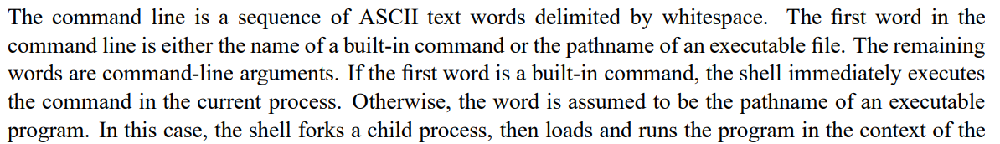

<!--
 * @Descripttion: 
 * @version: 
 * @Author: WakLouis
 * @Date: 2023-07-05 10:15:43
 * @LastEditors: WakLouis
 * @LastEditTime: 2023-07-05 12:00:30
-->
## 
支持作业控制的unix shell程序的设计与实现

## 介绍
通过编写简单的Unix shell以熟悉作业控制和信号量。

## 安装步骤

1. 解压缩安装包 tar xvf shlab-handout.tar
1. 使用 make 进行编译
1. 编辑tsh.c

## 内容

需要实现以下函数：

1. eval： Main routine that parses and interprets the command line.解析和解释命令行的主例程。

1. builtin_cmd: Recognizes and interprets the built-in commands: quit, fg, bg, and jobs. 识别和解释内置命令：quit, fg, bg 和 jobs.

1. do_bgfg: Implements the bg and fg built-in commands. 实现内置命令bg, fg.

1. waitfg: Waits for a foreground job to complete. 等待前台任务完成。

1. sigchld_handler: Catches SIGCHILD signals.捕获SIGCHILD信号。

1. sigint_handler: Catches SIGINT(ctrl-c) signals.捕获SIGINT信号。

1. sigtstp_handler: Catches SIGTSTP(ztrl-z) signals. 捕获SIGTSTP信号。

## 日志

### 2023.7.5

Shell 接收一个 command line 时，如果第一个单词是一个内置命令，则立刻在当前进程中执行该命令，否则认为是一个可执行程序的路径。
